# Introduction

This is to learn more about how unity works, and what we can do in unity in general. This would be based on the following tutorial [here](https://www.youtube.com/watch?v=XtQMytORBmM). I think this is highly recommended in general.

Ok so lets get started

## Installation

I'm using a mac, so I had to install rosetta to interface with unity hub. Once that is done, you can get started with using unity, as you please, but in my case, I will try to understand more about how things work and what they do in order to better understand the platform as well.

Essentially under `Installs` what you want to do is install things that you want to install

- For the time being, or rather for this demo, we're not really installing anything, but in the future, in more 3D related demos, we'll be installing support for iOS and Android. But anywhoo, this should work just fine for the time being.

## 4 main parts

When you look at the unity window, there are 4 main parts to consider (I used to think these are random names, but its actually what they are called):

### Project Panel

This is what the project looks like:

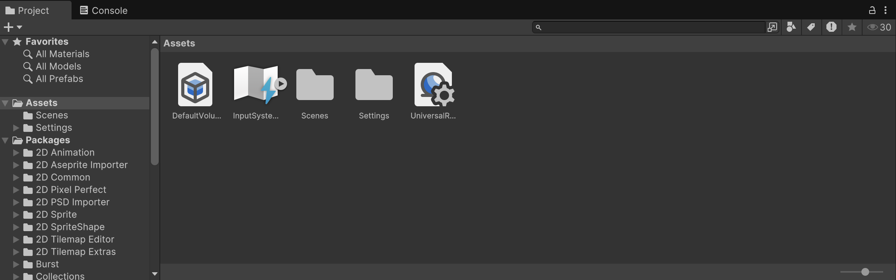

For context, the project contains:

- Sprites (Like blended images in the simplest sense)
- Sound effects
- Scripts
- Tiles
- etc.

So what you can do, is take 2 images of a bird and a sprite and dump them in. I found some online and decided to use them.

### Hierarchy Panel

This is what this pane looks like:

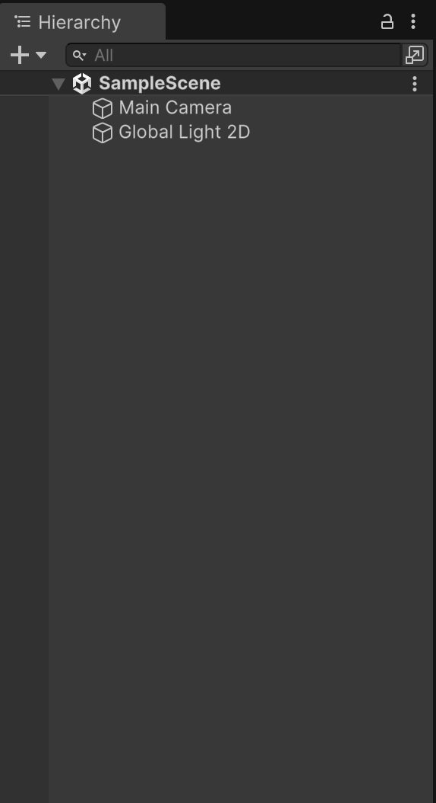

Essentially, everything in this scene can be seen here. A scene (for the time being) could be understood to be something like a level.

So as you can see, for the time being, we have a camera and a light.

#### Creating a `GameObject`

Hit `Shift+Command+N` to create an empty (this is a GameObject).

An invisible container, with some position, rotation and scale to fill this container with components to add more value to this object. For example, if we add a `SpriteRenderer` component to this game object, we can add the Bird image on top of this.

Everything can be a game object, the bird, pipes and camera that is moving around as well.

The Panel that is responsible for the behaviour of each of these `GameObjects` is aptly called, the `Inspector`.

### Inspector Panel

This is the panel that is responsible for how the game object peforms in a situation. How does it react to gravity, how does it move around, etc.

Now in order to add the `sprite renderer`, all you have to do is:

Press `Add Component`

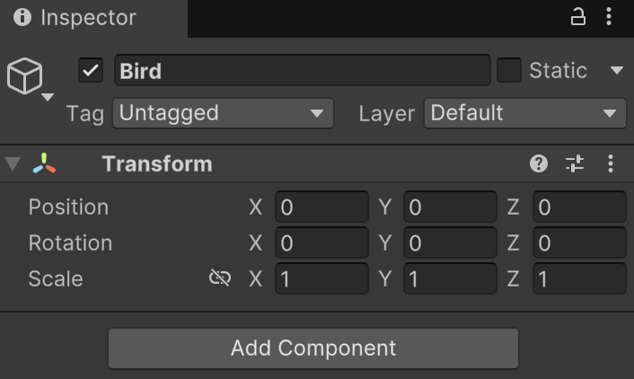

Type `Sprite Renderer`

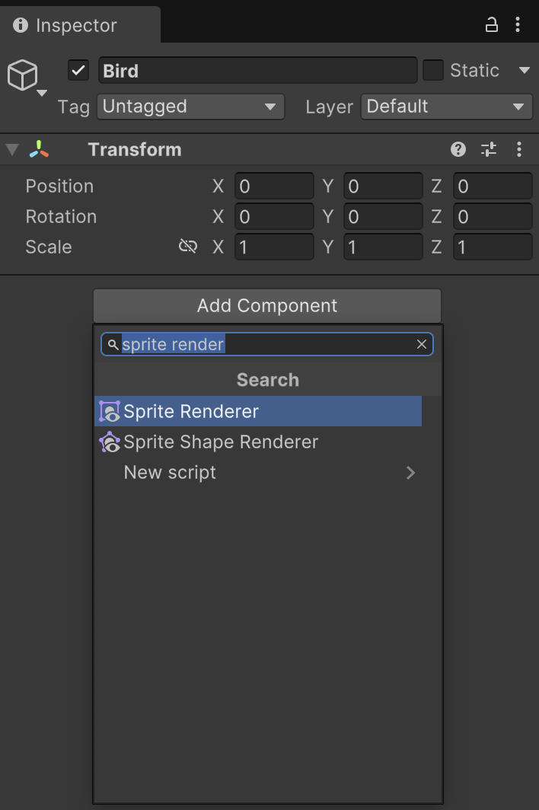

Select the sprite that you want to render in this case:

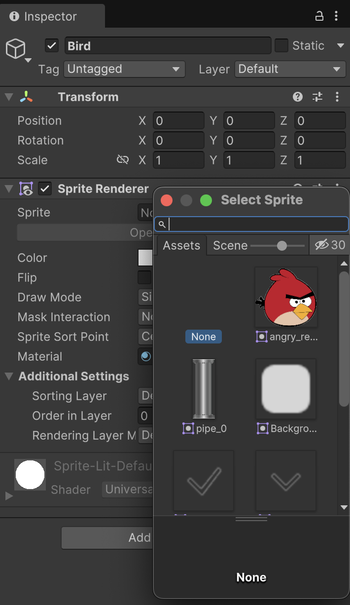

### Scene Panel

This is the last panel, here you can see what is in the view at that point in time. In my case, its the following:

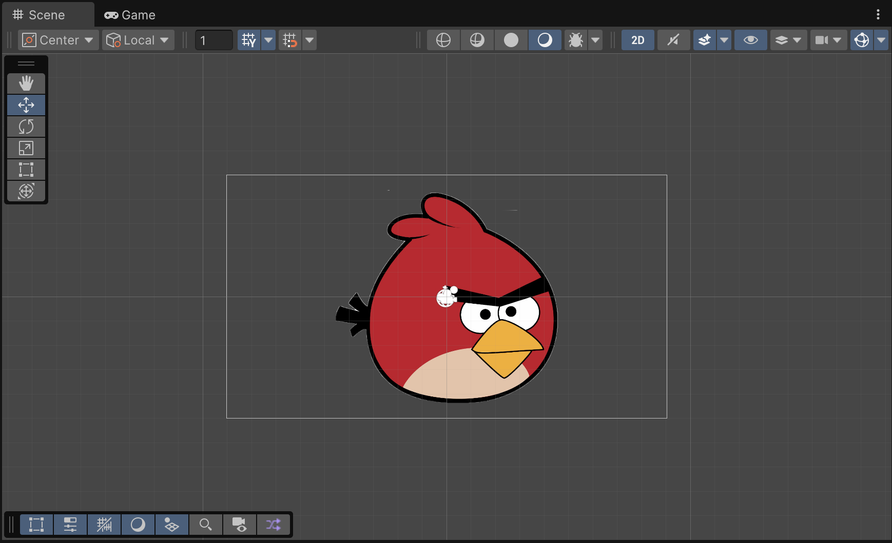

### Big Bird

Now the bird is too big, how can we solve this.

You could just change the scale of the bird by messing with the game object, but you could also mess with the `MainCamera`

Click the `MainCamera` from the `Hierarchy Panel`.

You'd see the following in the inspector:

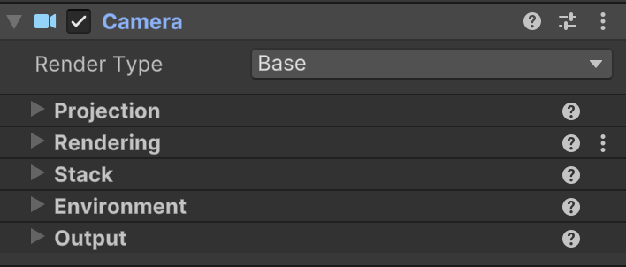

In order to change the size of the camera, head over to `Projection` and change it to to an arbitrary size.

While at it, head over to the `Environment` and change the colour of the background as well.

And this is it, this is the very first game, that does nothing.

## Now onto the physics objects

### Adding `RigidBody`

So in order to add more physics related abilities to our bird, we can add the following:

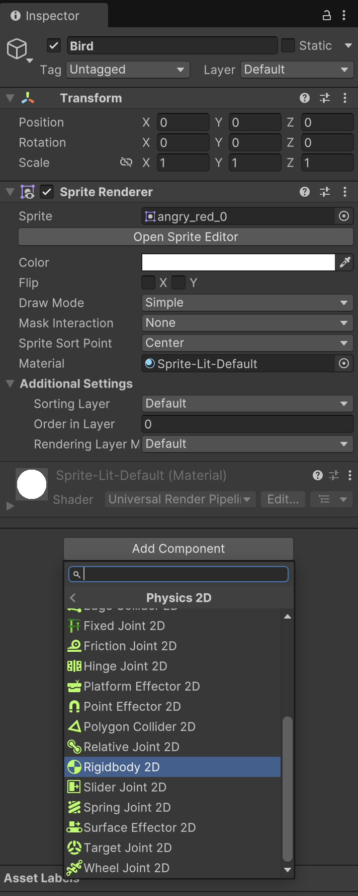

Add `RigidBody2D` to the bird,this can be found under `Physics Objects`.

This would make your bird fall straight down, you can tweak things like the mass of the `GameObject` and how the effect of gravity on this object.

### Adding `CircleCollider` and some Mechanics

Now we want to see how this bird would interact with the pipes, so we would need to simulate some sort of interaction with the pipes. So adding a cirucle collider would allow us to understand how the objects would interact based on collisions.

In my case, this is what it looks like:

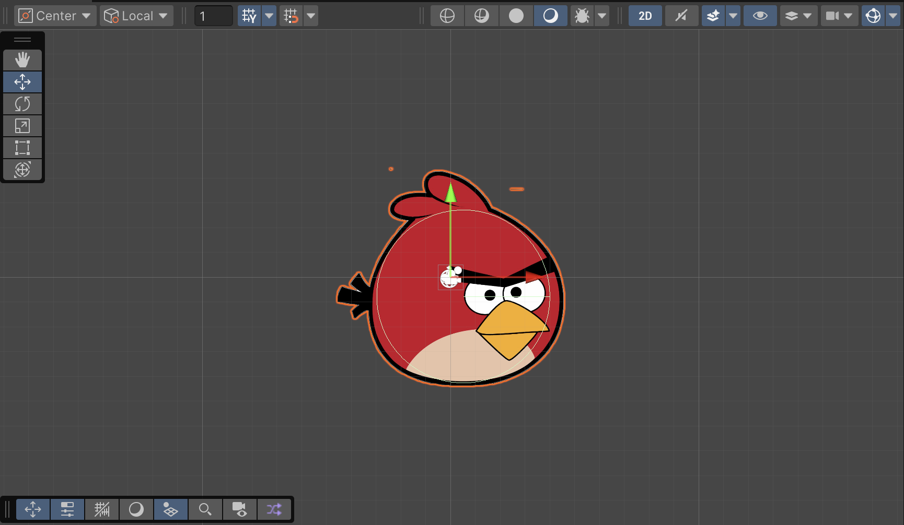

So once you add the `CircleCollider`, its time to write some code which would dictate the way this interacts
with the rest of the pipes.

So add a new component, by selecting `New Script`.

Name the script whatever you want, I'm naming it `BirdScript`.

Once that is done, add the component, and time to edit some C# on Visual Studio Code on macos.

### Coding in C#

When you open the script, you woudld see the following code:

```csharp
using UnityEngine;

public class BirdScript : MonoBehaviour
{
    // Start is called once before the first execution of Update after the MonoBehaviour is created
    void Start()
    {
        
    }

    // Update is called once per frame
    void Update()
    {
        
    }
}
```

There are 2 methods that one would need to care more about:
- `Start()`
  - Start only **runs once at the start, and does only one action one time**.
- `Update()`
  - Update runs **once every frame, for as long as it needs to run**.

Since you're writing this for the `Bird` game object, you can use this to change the attributes of the bird real fast.

Not only the bird, but also the camera and other related phenomenon.

`start()` can be changed to something of this sort:

```csharp
void Start()
    {
        gameObject.name = "HEHE";
    }
```

I could change the name at the very start.

Or if you're like me, and want to cause as much chaos as possible, you could change the name of the `GameObject` to get longer and longer during the run.

In essence, this would cause it to never ever work (DONT DO IT)

#### Connecting the `RigidBody2D` to the `BirdScript`.

As of now, we have no interface between these 2. As a matter of fact, `BirdScript` can only access the 
top bit, and `Transform` bit, it cannot access the other components that we have just added to it. So how can this be done?

Well, you just need to add a reference to this particular component in the script.

This can be done as follows:

```csharp
public Rigidbody2D rigidbody2D;
```

Adding this, would certainly link this to the rigidbody2D component.

> In order to link this, you would still need to drag and drop this, when required.

In my case, I wanted this to fly, so I added a force constant in the y Direction, in this way:

```csharp
void Update()
    {
        rigidbody2D.AddForceY(1);
    }
```

This would make it fly away, but what if I wanted one tap, and then for it to fall down.

How could that happen?

Well, add it just to the start

```csharp
using UnityEngine;

public class BirdScript : MonoBehaviour
{

    // Add a reference to the RigidBody2 sector
    public Rigidbody2D rigidbody2D;
    // Start is called once before the first execution of Update after the MonoBehaviour is created
    void Start()
    {
        rigidbody2D.AddForceY(600);
    }

    // Update is called once per frame
    void Update()
    {
    }
}
```

So this would make it jump a bit, and then fall down for ever.

But if you want to create something like a motion, you would need to use `linearVelocity` in C#.

This is what the code would look like:

```csharp
void Update()
    {
        if (Input.GetKeyDown(KeyCode.Space) == true)
        {
            rigidbody2D.linearVelocity = Vector2.up * 10;
        }
    }
```
> Whenever you detect a spacebar, add `Vector2.up` amount of velocity. For context Vector2.up is essentially (0,1) force in the Y direction.

So you can generalize and expand the same principle in the following way:

```csharp
void Update()
    {
        Dictionary<KeyCode, Vector2> movement = new Dictionary<KeyCode, Vector2>{
            {KeyCode.W, Vector2.up},
            {KeyCode.A, Vector2.left},
            {KeyCode.S, Vector2.down},
            {KeyCode.D, Vector2.right}
        };

        if (Input.anyKeyDown)
        {
            foreach (KeyCode keyCode in System.Enum.GetValues(typeof(KeyCode)))
            {
                if (Input.GetKeyDown(keyCode) && movement.ContainsKey(keyCode))
                {
                    // Set the rigidbody velocity based on the dictionary value
                    rigidbody2D.linearVelocity = movement[keyCode] * 10;
                }

            }
        }
    }
```

In essence, what you're doing is that at every keystroke you're moving.

But then again, that is not the point of this, so we move on to the following instead.

### Add more variables

Now, the strength of each flap doesn't really look right. Whats the best way to do this? We can add a new variable that accounts for this thing called flap strength. This can be done in the same way that we added `RigidBody2D` to our code.

```csharp
{

    // Add a reference to the RigidBody2 sector
    public new Rigidbody2D rigidbody2D;
    public float flapStrength;
    // Start is called once before the first execution of Update after the MonoBehaviour is created
    void Start()
    {
    }

    // Update is called once per frame
    void Update()
    {
        if (Input.GetKeyDown(KeyCode.Space) == true)
        {
            rigidbody2D.linearVelocity = Vector2.up * flapStrength;
        }
    }
}
```

Will lead to something like this:

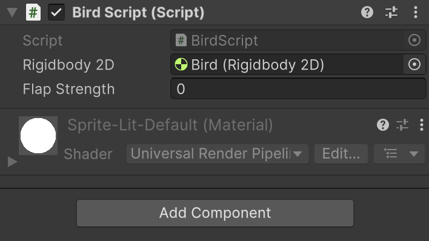

### Randomized pipe spawning into the world and make them delete themselves

So first you want to create a new game object called pipe. And then you can actually nest game objects in each other.

When you nest game objects inside each other, you can control the functionality of each of these game objects indivdually. Something like this:

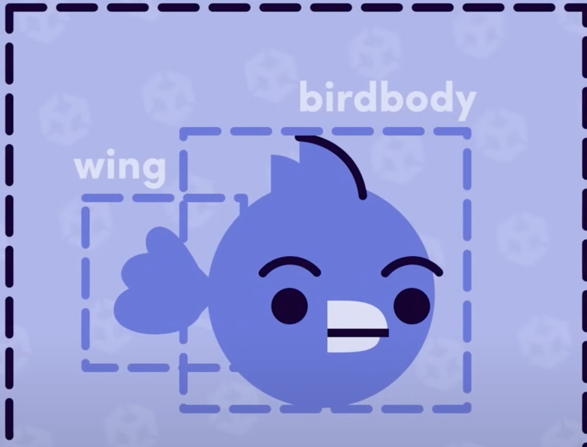

So in essence, what you have to do, is create a `pipe` game object, and then create 2 sub parts of these objects

In order to create the subpart(sub game object), you just need to `RightClick` on the `GameObject` and click `Add Empty`. This would allow you to create sub objects. Note that when you click the main object, you would be able to move both parts of pipes together.

So it would look something like this:

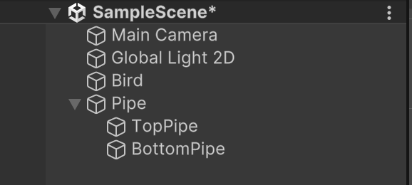

And the whole thing would look something like this:

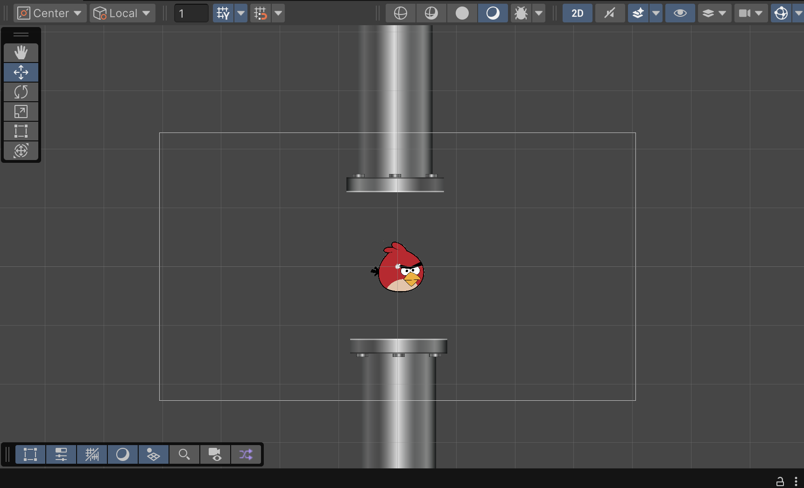

### Making the pipes move

> For context, the white box around this, is considered to be the game area, where everything you do would be rednered between this frame. So if you're checking for scaling, you might want to expand out and check for these boxes.


Now, we make the pipes move, this can be done by writing a simple script

All you really have to do, is to transform this object and transform it on along the x-axis. So in this case we can make use of `Vector3.Left` to help us to do this.

So it can be something like this:

```csharp
using UnityEngine;

public class PipeMotionScript : MonoBehaviour
{
    // Start is called once before the first execution of Update after the MonoBehaviour is created
    public float moveSpeed = 2;
    void Start()
    {

    }

    // Update is called once per frame
    void Update()
    {
        transform.position += Vector3.left * moveSpeed;
    }
}

```

> You would need to play with `moveSpeed` in order to be able to move this.

So when you use something like 2, you'd begin to realize that this is very very fast, and this can be solved, once you see the framerate during the game execution.

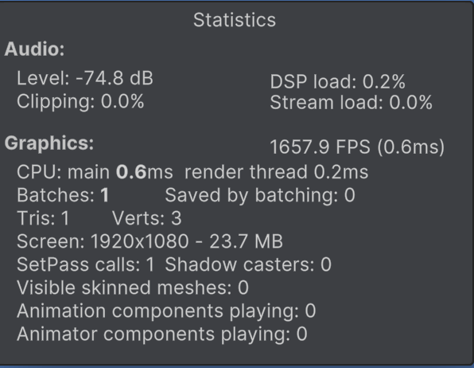

yeah, we're running on 1658 frames per second, which is a bad bad idea. This is because of the game running itself, and being agnostic about different framerates on different devices. In order to get around this, we would need to ensure that we multiply this with a `timeDelta`.

A balancer for devices across framerate issues.

> We don't need it for the physics engine side of things, since it runs on its own clocks for the most bit.

So the final code would look like this

```csharp
void Update()
    {
        transform.position += Vector3.left * moveSpeed * Time.deltaTime;
    }
```

The best place to check for something of this sort would be the `Unity` docs,and you would find more information and sample code.

So now that the `Pipe` game object has been place in nicely, what we can do is create a `PreFab`.

#### Prefabricated Game Objects

Essentially these are custom built game objects with a certain sense of inherent physics ability (and texture and sprites) that can be used and modified by creating other game objects based on them. Its a bit like this is the abstract class now, and the other game objects are existing on the same place, more or less.

So now once this has been done (You'd see `pipe` as a separate asset under the assets class).

No we can create a new game object, and make use of this game object. There are many ways to work with this data, but in our case we'll wrap this inside another game object, and this game object can start spawning the object slightly better.

Now we delete the pipe `GameObject` and basically end up using this prefab inside another game object

So we basically just create another `GameObject` called `PipeSpawner` and add some code using a script called  `PipeSpawnerScript`.

#### Spawning `GameObjects`.

This can be done using the `Instantiate` command, which is basically the eequivalent of a constructor, and seems to serve the same purpose.

The code might look  like this:

```csharp
void Update()
    {
        Instantiate(pipe, transform.position, transform.rotation);
    }
```

Now, this might seem right, but it ends up producing the wrong sort of effect.

The pipes are moving since the prefab object's nature is to move, as we defined each pipe in the script earlier. However, each object is moving, which means that we need to consider something.

The pipes that are moving, need to be spaced out, by the higher level object.

#### Building a timer to spawn between seconds

Essentially, need to create a spawner that we can use to spawn, and cause a delay between spawn times.

```csharp
using UnityEngine;

public class PipeSpawnerScript : MonoBehaviour
{
    // Start is called once before the first execution of Update after the MonoBehaviour is created
    public GameObject pipe;
    public float spawnRate = 2; // The time/number of frames between spawn
    private float timer = 0; // The main timer
    void Start()
    {

    }

    // Update is called once per frame
    void Update()
    {
        // Use this like a for loop
        if (timer < spawnRate)
        {
            // To account per frame rate
            timer += Time.deltaTime;
        }
        else
        {
            timer = 0;
            Instantiate(pipe, transform.position, transform.rotation);
        }
    }
}

```
